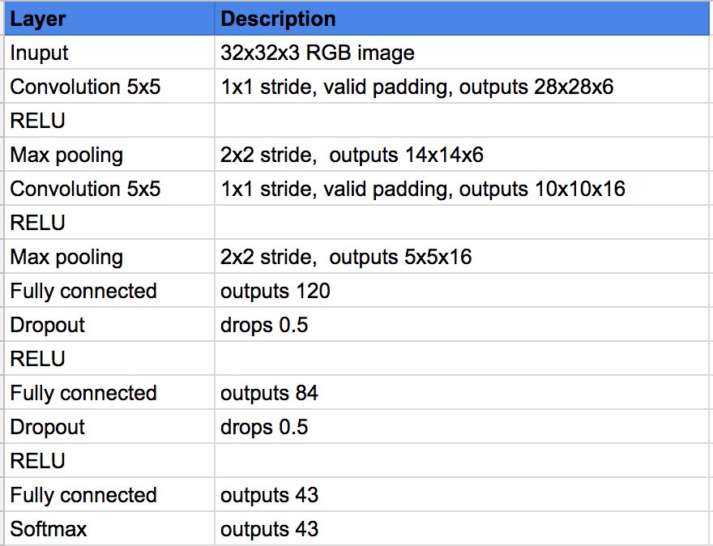
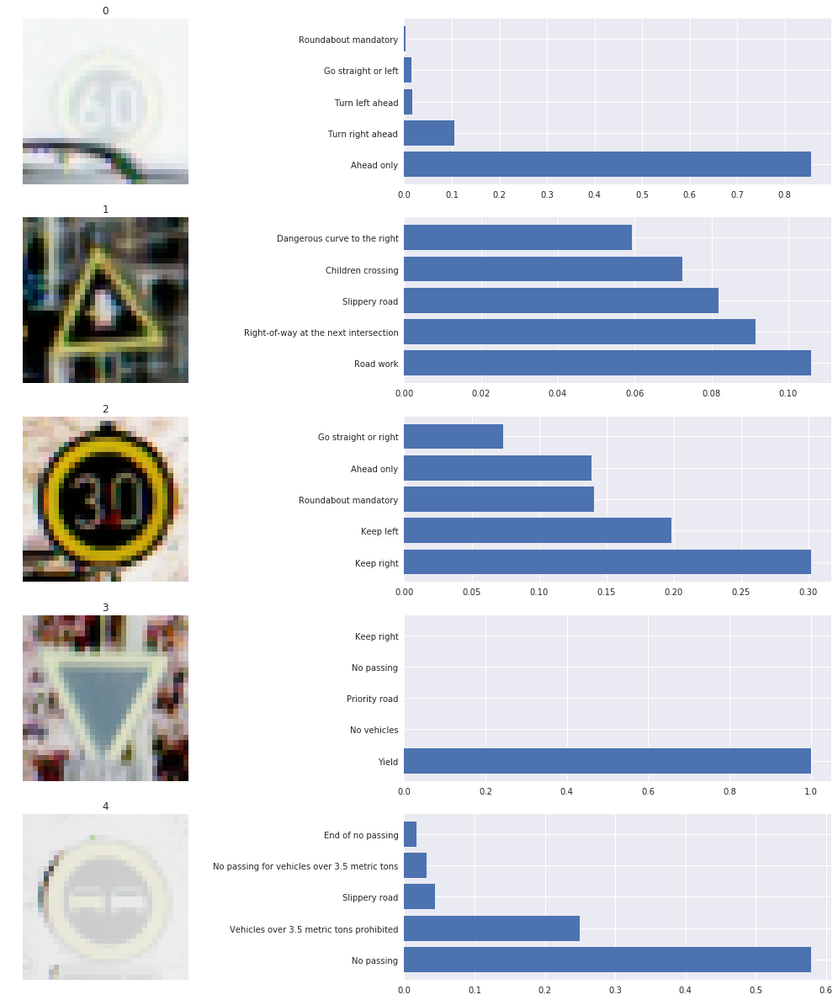

#**Traffic Sign Recognition** 

---

## **Build a Traffic Sign Recognition Project**

The goals / steps of this project are the following:

* Load the [data set](https://d17h27t6h515a5.cloudfront.net/topher/2017/February/5898cd6f_traffic-signs-data/traffic-signs-data.zip)
* Explore, summarize and visualize the data set
* Design, train and test a model architecture
* Use the model to make predictions on new images
* Analyze the softmax probabilities of the new images
* Summarize the results with a written report

[//]: # (Image References)

[image1]: ./examples/visualization.jpg "Visualization"
[image2]: ./examples/grayscale.jpg "Grayscaling"
[image3]: ./examples/random_noise.jpg "Random Noise"
[image4]: ./examples/placeholder.png "Traffic Sign 1"
[image5]: ./examples/placeholder.png "Traffic Sign 2"
[image6]: ./examples/placeholder.png "Traffic Sign 3"
[image7]: ./examples/placeholder.png "Traffic Sign 4"
[image8]: ./examples/placeholder.png "Traffic Sign 5"

[image9]: ./TFD/training_data_sample.png "Training image samples from each class"
[image10]: ./TFD/bar_chart.png "Distribution of classes in training datasets"
[image11]: ./TFD/bar_chart_val.png "Distribution of classes in validation datasets"
[image12]: ./TFD/bar_chart_test.png "Distribution of classes in test datasets"
[image13]: ./TFD/augment.png "Raw image, processed image and flipped image"
[image15]: ./TFD/learning_curves_94.jpg "Accuracy vs Loss - Learning Curve"

[image16]: ./new_images/00000_16.png "test1"
[image17]: ./new_images/00014_04.png "test2"
[image18]: ./new_images/00002_38.png "test3"
[image19]: ./new_images/00003_33.png "test4"
[image20]: ./new_images/00008_25.png "test5"

Here is a link to my [project code](https://github.com/prakritibanik/CarND-Traffic-Sign-Classifier-Project/blob/master/Traffic_Sign_Classifier.ipynb)

###Data Set Summary & Exploration

####1. A basic summary of the data set is presented below. 

I used the pandas library to calculate summary statistics of the traffic
signs data set:

* The size of training set is 34799
* The size of the validation set is 4410
* The size of test set is 12630
* The shape of a traffic sign image is Height = 32, Width = 32, Channel = 3
* The number of unique classes/labels in the data set is 43

####2. Exploratory visualization of the dataset.

The image below displays one traffic sign image from each class.

![training samples][image9]

The distribution of classes in training dataset is shown here.

![class dist][image10]

The distribution of classes in validation dataset is shown here.

![class dist][image11]

Similarly the distribution of classes in test dataset is shown in the following image.

![class dist][image12]

###Design and Test a Model Architecture

####1.a) Preprocessing
I processed the image data to be normalized so that the data has mean zero and equal variance, data_normalization() method achives that. Sometime an additional pre-procesing is done on images to normalizes each dimension so that the min and max along the dimension is -1 and 1 respectively. But in this case, the relative scales of pixels are already approximately equal (and in range from 0 to 255), so it is not strictly necessary to perform this additional pre-processing step.

Another pre-processing approach is PCA Whitening. But the problem with transformation is that it can greatly exaggerate the noise in the data, since it stretches all dimensions to be of equal size in the input. This was also not performed here.

In practice, these transformations are not used with Convolutional Neural Networks except to zero-center the data. And it is also common to see normalization of every pixel.

The code for preprocessing is located in the 4th cell of the Ipython notebook.

####1.b) Data Augmentation
Huge dataset is a crucial point for training a deep lerning network to produce satisfactory performance. So data augmentation is a always a good idea to boost the performance of a deep network.

For each image to the training dataset, horizontal flipping was applied and added to the dataset (flip_image method was used for this). Also a little bit of random Rotation, Translation and Shear operation was applied (transform_image method was used for this). Using these two approaches I trippled the training dataset.

The difference between the original data set and the augmented data set is the following

![aug data][image13]

The code for data augmentation is located in the 5th cell of the Ipython notebook.

####2. Final model architecture

My final model consisted of the following layers:

The code for my model architecture is located in the 6th cell of the Ipython notebook.

####3. Training my model

To train the model, I used different approaches. 
Firstly, I used the LeNet model from class epoch = 100, learning rate = 0.001, batch size = 128 which gave training accuracy of .98 and validation accuracy of 0.924. I used AdamOptimizer in all models.

My second model included pre-processing described above, epoch = 100, learning rate = 0.001, batch size = 128 and that gave a highest validation accuracy of 0.915

Net I tried increasing epoch to 200. But the model was overfitting. After few epochs the training accuracy was 1 but the validation accuracy was very low, .90. A high accuracy on the training set but low accuracy on the validation set indicates over fitting. Here we can see that.

Next I increased the batch size to 512, and the accuracy further decreased to .8644. The model is still overfitting.

Next I augmented more data to the training as described above. Now total training dataset size was 104397. With epoch = 200, learning rate = 0.001, batch size = 512. I achived .8485 accuracy.

Finally, I added dropout of 0.5 after first and second fully connected layer to deal with the overfitting. epoch = 300, learning rate = 0.001, batch size = 512 Also I discarded the flipped images from the training set. This time the training accuracy is 0.8179 but the validation accuracy was 0.9331.

The learning curve is as follows from the training mentioned above.

![learn1][image15]

The code for training and evaluation of my model is located in the 7th, 8th and 9th cell of the Ipython notebook.

####4. Approach to reach the desired performance
As mentioned above, while training I started with a very basic model LeNet solution from class. Then I kept on changing the training parameters one at a time. For example, I started with adding preprcessing, then changing learning rate, then changing batch size, then epoch size, then augmented more data, then added dropout. As the model overfit or underfit I made a decision to overcome that. The model has lots of parameters and an exhaustive training approach to fine tune all the parameters will definitely improve the accuracy.

The final model is suitable for this project as its producing descent accuracy on the training and validation dataset. Its not overfitting or underfitting. So we can reply on this model.

My final model results were:

* training set accuracy of 0.8179
* validation set accuracy of 0.9331
* test set accuracy of 0.9074

###Test a Model on New Images

####1. Results on German traffic signs found on the web
I tested the final model on 15 German traffic signs from web. and provide them in the report. Here are five German traffic signs from the collection of 15 images that I found on the web:

![alt text][image16] ![alt text][image17] ![alt text][image18] 
![alt text][image19] ![alt text][image20]

The second image might be difficult to classify because of the presence of shdow on the sign. Also the fourth image is not very clear too and small in size. That might make the classification difficult.

####2. Model's predictions on these new traffic signs
 and compare the results to predicting on the test set. At a minimum, discuss what the predictions were, the accuracy on these new predictions, and compare the accuracy to the accuracy on the test set (OPTIONAL: Discuss the results in more detail as described in the "Stand Out Suggestions" part of the rubric).

Here are the results of the prediction:

* Image: Speed limit (60km/h), Prediction: Ahead only
* Image: Right-of-way at the next intersection, Prediction: Road work
* Image: Speed limit (30km/h), Prediction: Keep right
* Image: Yield, Prediction: Yield
* Image: No passing, Prediction: No passing

The model was able to correctly guess 2 of the 5 traffic signs, which gives an accuracy of 40%.

The code for training and evaluation of my model is located in the 57th, 60th cell of the Ipython notebook

####3. Certainty of the model in predicting new image
From the plot below we can see each of the 15 new images by looking at the softmax probabilities for each prediction. Top 5 softmax probabilities for each image along with the sign type of each probability is depicted in the image.

